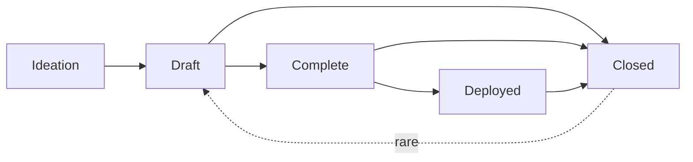

# REP-0001 - Reddcoin Enhancement Proposal Process

```
  REP: 1
  Title: Reddcoin Enhancement Proposal Process
  Authors: John (CryptoGnasher) Nash <gnasher@reddcoin.com>
  Status: Draft
  Type: Process
  Assigned: 2026-08-10
  License: BSD-2-Clause
  Version: 0.1.0
```

> **Editor's note - placeholders.** This document was adapted from
> [BIP 3](https://github.com/bitcoin/bips/blob/master/bip-0003.md) and still contains `TODO`
> markers where a Reddcoin-specific decision is outstanding: the REP Editors roster, and
> whether the existing REPs are converted to the preamble format specified here. Search for
> `TODO` before publishing.

## Abstract

This _Reddcoin Enhancement Proposal (REP)_ provides information about the preparation of REPs
and policies relating to the publication of REPs. It establishes the REP process for the
Reddcoin community, and may be amended to address the evolving needs of that process.

## Motivation

Reddcoin is forked from the Bitcoin codebase, and a large body of Bitcoin Improvement
Proposals (BIPs) applies to Reddcoin unchanged. The REP process is not intended to duplicate
that body of work. It exists to specify, review, and archive the changes that are **unique to
Reddcoin** - most notably its Proof-of-Stake-Velocity (PoSV) consensus mechanism, its social
tipping and micropayment features, the ReddID identity and naming system, and the
coordination of network upgrades.

Reddcoin previously had no written process document of its own, referring contributors to
[BIP 2](https://github.com/bitcoin/bips/blob/master/bip-0002.mediawiki) instead. BIP 2 has
since been replaced by BIP 3, which streamlines the workflow, reduces the judgment calls
assigned to the editor role, and delineates the proposal types more clearly. This REP adopts
that streamlined process for Reddcoin.

## Fundamentals

### What is a REP?

REPs are improvement proposals for Reddcoin. The main topic is information and technologies
that support and expand the utility of the Reddcoin currency. Most REPs provide a concise,
self-contained, technical description of one new concept, feature, or standard. Some REPs
describe processes, implementation guidelines, best practices, incident reports, or other
information relevant to the Reddcoin community. However, any topics related to the Reddcoin
protocol, peer-to-peer network, and client software may be acceptable.

REPs are intended to be a means for proposing new protocol features, coordinating client
standards, and documenting design decisions that have gone into implementations. REPs may be
submitted by anyone, provided the content is of high quality, e.g., does not waste the
community's time.

The scope of the REPs repository is limited to REPs that do not oppose the fundamental
principle that Reddcoin constitutes a peer-to-peer digital currency for social tipping and
micropayments, secured by Proof-of-Stake-Velocity.

### Relationship to Bitcoin BIPs

Because Reddcoin is derived from the Bitcoin codebase, many BIPs apply to Reddcoin directly
and are adopted without a corresponding REP. Authors should not write a REP that restates a
BIP. A REP is appropriate when:

* the proposal concerns behaviour unique to Reddcoin (PoSV, tipping, ReddID, and similar), or
* the proposal adapts a BIP in a way that changes its specification for Reddcoin, in which
  case the REP must state precisely how it diverges and cite the BIP it derives from, or
* the proposal coordinates a Reddcoin network upgrade.

Where a REP uses a classification defined by Bitcoin - such as the Layer header, defined in
[BIP 123](https://github.com/bitcoin/bips/blob/master/bip-0123.mediawiki) - it references the
BIP rather than restating it.

### REP Ownership

Each REP is primarily owned by its authors and represents the authors' opinion or
recommendation. The authors are expected to foster discussion, address feedback and dissenting
opinions, and, if applicable, advance the adoption of their proposal within the Reddcoin
community. As a REP progresses through the workflow, it becomes increasingly co-owned by the
Reddcoin community.

#### Authors and Deputies

Authors may want additional help with the REP process after writing an initial draft. In that
case, they may assign one or more Deputies to their REP. Deputies are stand-in owners of a REP
who were not involved in writing the document. They support the authors in advancing the
proposal, or act as a point of contact for the REP in the absence of the authors. Deputies may
perform the role of Authors for any aspect of the REP process unless overruled by an Author.
Deputies share ownership of the REP at the discretion of the Authors.

### What is the Significance of REPs?

REPs do not define what Reddcoin is: individual REPs do not represent Reddcoin community
consensus or a general recommendation for implementation. A REP represents a personal
recommendation by the REP authors to the Reddcoin community. Some REPs may never be adopted.
Some REPs may be adopted by one or more Reddcoin clients or other related software. Some may
even end up changing the consensus rules that the Reddcoin ecosystem jointly enforces.

### What is the Purpose of the REPs Repository?

The [REPs repository](https://github.com/reddcoin-project/reps) serves as a publication medium
and archive for mature proposals. Through its visibility, it facilitates the community-wide
consideration of REPs and provides a well-established source to retrieve the latest version of
any REP. The repository transparently records all changes to each REP and allows any community
member to retain a complete copy of the archive easily.

The REPs repository neither tracks community sentiment[^acceptance] nor ecosystem
adoption[^adoption] of REPs beyond the brief overview provided via the REP status (see
[Workflow](#workflow) below). Proposals are published in this repository if they are on-topic
and fulfill the editorial criteria. No formal or informal decision body governs Reddcoin
development or decides adoption of REPs.

## REP Format and Structure

### Specification

Authors may choose to submit REPs in Markdown[^markdown] or MediaWiki format. Markdown is
preferred.

Each REP must have a _Preamble_, an _Abstract_, a _Copyright_, and a _Motivation_ section.
Authors should consider all issues in the following list and address each as appropriate.

* Preamble - Headers containing metadata about the REP (see the section
  [REP Header Preamble](#rep-header-preamble) below).
* Abstract - A short description of the issue being addressed.
* Motivation - Why is this REP being written? Clearly explain how the existing situation
  presents a problem and why the proposed idea resolves the issue or improves upon the current
  situation.
* Specification - The technical specification should describe the syntax and semantics of any
  new feature. The specification should be detailed enough to enable any Reddcoin project to
  create an interoperable implementation.
* Rationale - The rationale fleshes out the specification by describing what inspired the
  design and why particular design decisions were made. It should describe related work and
  alternate designs that were considered. The rationale should record relevant objections or
  important concerns that were raised and addressed as this proposal was developed.
* Backward Compatibility - Any REP that introduces incompatibilities must include a section
  describing these incompatibilities and their severity as well as provide instructions on how
  implementers and users should deal with these incompatibilities. For consensus changes, this
  section must state whether the change is a soft fork or a hard fork and how it activates.
* Reference Implementation - Where applicable, a reference implementation, test vectors, and
  documentation must be finished before the REP can be given the status "Complete". Test
  vectors must be provided in the REP or as auxiliary files (see
  [Auxiliary Files](#auxiliary-files)) under an acceptable license. The reference
  implementation can be provided in the REP, as an auxiliary file, or per linking another code
  reference that is expected to remain available permanently such as a pull request, a
  dedicated branch, a new repository, or similar.
* Changelog - A section to track modifications to a REP after reaching Complete status.
* Copyright - The REP must be placed under an acceptable license (see
  [REP Licensing](#rep-licensing) below).

#### REP Header Preamble

Each REP must begin with an [RFC 822-style header preamble](https://www.w3.org/Protocols/rfc822/).
The headers must appear in the following order. Headers marked with "\*" are optional. All
other headers are required.

##### Overview

```
  REP: <REP number, or "?" before assignment>
* Layer: <Consensus (soft fork) | Consensus (hard fork) | Peer Services | API/RPC | Applications>
  Title: <REP title (<= 50 characters)>
  Authors: <Authors' names and email addresses>
* Deputies: <Deputies' names and email addresses>
  Status: <Draft | Complete | Deployed | Closed>
  Type: <Specification | Informational | Process>
  Assigned: <Date of number assignment (yyyy-mm-dd), or "?" before assignment>
  License: <SPDX License Expression>
* Discussion: <Noteworthy discussion threads in "yyyy-mm-dd: URL" format>
* Version: <MAJOR.MINOR.PATCH>
* Requires: <REP number(s)>
* Replaces: <REP number(s)>
* Proposed-Replacement: <REP number(s)>
```

##### Header Descriptions

* REP - The assigned number of the REP (without leading zeros). Please use "?" before a number
  has been assigned by the REP Editors.
* Layer - The layer of Reddcoin the REP applies to, using the classification defined in
  [BIP 123](https://github.com/bitcoin/bips/blob/master/bip-0123.mediawiki).
* Authors - The names (or pseudonyms) and email addresses of all authors of the REP. The format
  of each authors header value must be

      Random J. User <address@dom.ain>

  Multiple authors are recorded on separate lines:

      Authors: Random J. User <address@dom.ain>
               Anata Sample <anata@domain.example>

* Deputies - Additional owners of the REP that are not authors. The Deputies header uses the
  same format as the Authors header. See the [REP Ownership](#rep-ownership) section above.
* Status - The stage of the workflow of the proposal. See the [Workflow](#workflow) section
  below.
* Type - See the [REP Types](#rep-types) section below for a description of the three REP types.
* Assigned - The date a REP was assigned its number. Please use "?" before a number has been
  assigned by the REP Editors.
* License - The License header specifies SPDX License Expressions describing the terms under
  which the REP and its auxiliary files are available. See the [REP Licensing](#rep-licensing)
  section below.
* Discussion - The Discussion header points the audience to relevant discussions of the REP.
  Entries take the format "yyyy-mm-dd: URL", using the date and URL of the start of the
  conversation. Multiple discussions should be listed on separate lines.
* Version - The current version number of this REP. See the
  [Changelog](#changelog-section-and-version-header) section below.
* Requires - A list of existing REPs the new proposal depends on. If multiple REPs are
  required, they should be listed in one line separated by a comma and space (e.g., "1, 2").
* Replaces[^proposes-to-replace] - REP authors may put the numbers of one or more prior REPs in
  the Replaces header to recommend that their REP succeeds, supersedes, or renders obsolete
  those prior REPs.
* Proposed-Replacement[^superseded-by-proposed-replacement] - When a later REP indicates that
  it intends to supersede an existing REP, the later REP's number is added to the
  Proposed-Replacement header of the existing REP to indicate the potential successor REP.

#### Auxiliary Files

REPs may include auxiliary files such as diagrams and source code. Auxiliary files must be
included in a subdirectory for that REP named `rep-XXXX`, where "XXXX" is the REP number
zero-padded to four digits. File names in the subdirectory do not need to adhere to a specific
convention.

### REP Types

* A **Specification REP** defines a set of technical rules describing a new feature or
  affecting the interoperability of implementations. The distinguishing characteristic of a
  Specification REP is that it can be implemented, and implementations can be compliant with
  it. Specification REPs must have a Specification section, must have a Backward Compatibility
  section (if incompatibilities are introduced), and can only be advanced to Complete after
  they contain or refer to a reference implementation and test vectors.
* An **Informational REP** describes a Reddcoin design issue, or provides general guidelines or
  other information to the Reddcoin community.
* A **Process REP** describes a process surrounding Reddcoin, or proposes a change to (or an
  event in) a process. Process REPs are like Specification REPs, but apply to topics other than
  the Reddcoin protocol and Reddcoin implementations. They often require community consensus
  and are typically binding for the corresponding process. Examples include procedures,
  guidelines, and changes to decision-making processes such as the REP process.

## Workflow

The REP process starts with a new idea for Reddcoin. Each potential REP must have authors  - 
people who write the REP, gather feedback, shepherd the discussion in the appropriate forums,
and finally recommend a mature proposal to the community.



### Ideation

After having an idea, the authors should evaluate whether it meets the criteria to become a
REP, as described in this REP. The idea must be of interest to the broader community or
relevant to multiple software projects. Minor improvements and matters concerning only a single
project usually do not require standardization and should instead be brought up directly to the
relevant project.

The authors should first research whether their idea has been considered before, both in the
REPs repository and among the BIPs, since a Reddcoin problem is often a solved Bitcoin problem.
Prior related discussions may inform the authors of the issues that may arise in its
progression. After some investigation, the novelty and viability of the idea should be tested
by posting a new, dedicated thread about the idea to
[Reddcoin Development Discussions](https://github.com/orgs/reddcoin-project/discussions), the
canonical public venue for Reddcoin development discussion. Prior correspondence can be found
by searching that forum.

It is recommended that authors establish before or at the start of working on a draft whether
their idea may be of interest to the Reddcoin community. Authors should avoid opening a pull
request with a REP draft out of the blue. Vetting an idea publicly before investing time and
effort to formally describe the idea is meant to save time for both the authors and the
community. Not only may someone point out relevant discussion topics that were missed in the
authors' research, or that an idea is guaranteed to be rejected based on prior discussions, but
describing an idea publicly also tests whether it is of interest to more people beside the
authors.

As a first sketch of the proposal is taking shape, the authors should present it in
[Reddcoin Development Discussions](https://github.com/orgs/reddcoin-project/discussions). This
gives the authors a chance to collect initial
feedback and address fundamental concerns. If the authors wish to work in public on the
proposal at this stage, it is recommended that they open a pull request against one of their
forks of the REPs repository instead of the main REPs repository.

It is recommended that complicated proposals be split into separate REPs that each focus on a
specific component of the overall proposal.

### Progression through REP Statuses

The following sections refer to REP Status field values. The REP Status field is defined in the
Header Preamble specification above.

#### Draft

After fleshing out the proposal further and ensuring that it is of high quality and properly
formatted, the authors should open a pull request to the
[REPs repository](https://github.com/reddcoin-project/reps). The document must adhere to the
formatting requirements specified above and should be provided as a file named with a working
title of the form "rep-title.[md|mediawiki]". Only REP Editors may assign REP numbers. Until
one has done so, authors should refer to their REP by name only.

REPs that (1) adhere to the formatting requirements, (2) are on-topic, and (3) have materially
progressed beyond the ideation phase, e.g., by generating substantial public discussion and
commentary from diverse contributors, by independent Reddcoin projects working on adopting the
proposal, or by the authors working for an extended period toward improving the proposal based
on community feedback, will be assigned a number by a REP Editor. A number may be considered
assigned only after it has been publicly announced in the pull request by a REP Editor. The REP
Editors should not assign a number when they perceive a proposal being met with lack of
interest: number assignment facilitates the distributed discussion of ideas, but before a
proposal garners some interest in the Reddcoin community, there is no need to refer to it by a
number.

Proposals are also not ready for number assignment if they duplicate efforts, disregard
formatting rules, are too unfocused or too broad, fail to provide proper motivation, fail to
address backward compatibility where necessary, or fail to specify the feature clearly and
comprehensively. Reviewers and REP Editors should provide guidance on how the proposal may be
improved to progress toward readiness. Pull requests that are proposing off-topic ideas or have
stopped making progress may be closed.

When the proposal is ready and has been assigned a number, a REP Editor will merge it into the
REPs repository. After the REP has been merged to the repository, its main focus should no
longer shift significantly, even while the authors may continue to update the proposal as
necessary. Updates to merged documents by the authors should also be submitted as pull
requests.

#### Complete[^complete]

When the authors have concluded all planned work on their proposal, are confident that their
REP represents a net improvement, is clear, comprehensive, and is ready for adoption by the
Reddcoin community, they may update the REP's status to Complete to indicate that they
recommend adoption, implementation, or deployment of the REP. Where applicable, the authors
must ensure that any proposed specification is solid, not unduly complicated, and definitive.
Specification REPs must come with or refer to a working reference implementation and
comprehensive test vectors before they can be moved to Complete. Subsequently, the REP's
content should only be adjusted in minor details, e.g., to improve language, clarify
ambiguities, backfill omissions in the specification, add test vectors for edge cases, or
address other issues discovered as the REP is being adopted.

A Complete REP can only move to Deployed or Closed. Any necessary changes to the specification
should be minimal and interfere as little as possible with ongoing adoption. If a Complete REP
is found to need substantial functional changes, it may be preferable to move it to
Closed[^new-REP], and to start a new REP with the changes instead. Otherwise, it could cause
confusion as to what being compliant with the REP means.

A REP may remain in the Complete status indefinitely[^rejection] unless its authors or deputies
decide to move it to Closed or it is advanced to Deployed. Complete is the final status for
most successful Informational REPs.

#### Deployed

A Complete REP should only be moved to Deployed once it is settled: after its approach has
solidified, its Specification has been put through its paces, feedback from early adopters has
been processed, and amendments to the REP have stopped. Then, a REP may be advanced to Deployed
upon request by any community member with evidence[^evidence] that the REP is in active use.
Convincing evidence includes for example: an established project having deployed support for
the REP in mainnet software releases, a soft fork proposal's activation criteria having been
met on the network, or rough consensus for the REP having been demonstrated.

Once Deployed, the REP is considered final. Any modifications to the REP beyond bug fixes,
other minor amendments, additions to the test vectors, or editorial changes should be avoided.
Any breaking changes to the REP's Specification should be proposed as a new separate
REP.[^new-REP]

##### Process REPs

A Process REP may change status from Complete to Deployed when it achieves rough consensus in
[Reddcoin Development Discussions](https://github.com/orgs/reddcoin-project/discussions). A
proposal is said to have rough consensus if its
advancement has been open to discussion for at least one month, the discussion achieved
meaningful engagement, and no person maintains any unaddressed substantiated objections to it.
Addressed or obstructive objections may be ignored/overruled by general agreement that they
have been sufficiently addressed, but clear reasoning must be given in such circumstances.
Deployed Process REPs may be modified indefinitely as long as a proposed modification has rough
consensus per the same criteria.[^living-documents]

#### Closed[^closed]

A REP that is of historical interest only, and is not being actively worked on, promoted or in
active use, should be marked as Closed. The reason for moving the proposal to (or from) Closed
should be recorded in the Changelog section in the same commit that updates the status. REPs do
not get deleted, they are retained even after being updated to Closed. Transitions involving
the Closed state are:

##### Draft -> Closed

REP authors may decide on their own to change their REP's status from Draft to Closed. If a
Draft REP stops making progress, sees accumulated feedback unaddressed, or otherwise appears
stalled for a year, anyone may propose the REP status be updated to Closed. The REP is then
updated to Closed unless the authors assert that they intend to continue work within four weeks
of being contacted.

##### Complete -> Closed

REPs that had attained the Complete status, i.e., that had been recommended for adoption, may
be moved to Closed per the authors' announcement in Reddcoin Development
Discussions[^rep-announcements]. However, if someone volunteers to adopt the proposal within four
weeks, they become the REP's author or deputy (see
[Transferring REP Ownership](#transferring-rep-ownership) below), and the REP will remain
Complete instead.

##### Deployed -> Closed

A REP may evolve from Deployed to Closed when it is no longer in active use. Any community
member may initiate this Status update by announcing it in Reddcoin Development
Discussions[^rep-announcements], and proceed if no objections have been raised for four weeks.

##### Closed -> Draft

The Closed status is generally intended to be a final status for REPs, and if REP authors
decide to make another attempt at a previously Closed REP, it is generally recommended to
create a new proposal. (Obviously, the authors may borrow any amount of inspiration or actual
text from any prior REPs as licensing permits.) The authors should take special care to address
the issues that caused the prior attempt's abandonment. Even if the prior attempt had been
assigned a number, the new REP will generally be assigned a distinct number. However, if it is
obvious that the new attempt directly continues work on the same idea, it may be reasonable to
return the Closed REP to Draft status.

### Changelog Section and Version Header

To help implementers understand updates to a REP, any changes after it has reached Complete
must be tracked with version, date, and description in a Changelog section sorted by most
recent version first. The version number is inspired by semantic versioning
(MAJOR.MINOR.PATCH). The MAJOR version is incremented if changes to the REP's Specification are
introduced that are incompatible with prior versions (which should be rare after a REP is
Complete, and only happen in well-grounded exceptional cases to a REP that is Deployed). The
MINOR version is incremented whenever the specification of the REP is changed or extended in a
backward-compatible way. The PATCH version is incremented for other changes to the REP that are
noteworthy (bug fixes, test vectors, important clarifications, etc.). Version 1.0.0 is used to
label the promotion to Complete. A Changelog section may be introduced during the Draft phase
to record significant changes (using versions 0.x.y).

Example:

> __Changelog__
>
> * __2.0.0__ (2026-01-22):
>     * Introduce a breaking change in the specification to fix a bug.
> * __1.1.0__ (2026-01-17):
>     * Add a backward compatible extension to the REP.
> * __1.0.1__ (2026-01-15):
>     * Clarify an edge case and add corresponding test vectors.
> * __1.0.0__ (2026-01-14):
>     * Complete planned work on the REP.

After a REP receives a Changelog, the Preamble must indicate the latest version in the Version
header. The Changelog highlights revisions to REPs to human readers. A single REP shall not
recommend more than one variant of an idea at the same time. A different or competing variant
of an existing REP must be published as a separate REP.

### Adoption of Proposals

The REPs repository does not track the sentiment on proposals and does not track the adoption
of REPs beyond whether they are in active use or not. It is not intended for REPs to list
additional implementations beyond the reference implementation: the REPs repository is not a
signpost where to find implementations.[^OtherImplementations] After a REP is advanced to
Complete, it is up to the Reddcoin community to evaluate, adopt, ignore, or reject a REP.
Individual Reddcoin projects are encouraged to publish a list of REPs they implement.

### Transferring REP Ownership

It occasionally becomes necessary to transfer ownership of REPs to new owners. In general, it
would be preferable to retain the original authors of the transferred REP, but that is up to
the original authors. A good reason to transfer ownership is because the original authors no
longer have the time or interest in updating it or following through with the REP process, or
are unreachable or unresponsive. A bad reason to transfer ownership is because someone doesn't
agree with the direction of the REP. The community tries to build consensus around a REP, but
if that's not possible, rather than fighting over control, the dissenters should supply a
competing REP.

If someone is interested in assuming ownership of a REP, they should send a message asking to
take over, addressed to the original authors, the REP Editors, and Reddcoin Development
Discussions[^rep-announcements]. If the authors are unreachable or do not respond in a
timely manner (e.g., four weeks), the REP Editors will make a unilateral decision whether to
appoint the applicants as [Authors or Deputies](#authors-and-deputies) (which may be amended
should the original authors make a delayed reappearance).

## REP Licensing

Reddcoin is a global peer-to-peer digital currency. Open standards are indispensable for
continued interoperability. Open standards reduce friction, and encourage anybody and everyone
to contribute, compete, and innovate on a level playing field. Only freely licensed
contributions are accepted to the REPs repository.

### Specification

Each new REP must specify in two ways under which license terms it is made available. First, it
must specify an [SPDX License Expression](https://spdx.dev/ids/) in the License field in the
preamble. Second, it must include a matching Copyright section, possibly providing further
details on licensing.

For example, a preamble might include the following License header:

    License: CC0-1.0 OR MIT

In this case, the REP (including all auxiliary files) is made available under the terms of both
CC0 1.0 Universal as well as the MIT License, and anyone may modify and redistribute it
provided they comply with the terms of *either* license, at their option. In other words, the
license list is an "OR choice", not an "AND also" requirement. See the
[SPDX documentation](https://spdx.dev/ids/) and the
[SPDX License List](https://spdx.org/licenses/) for further details.

Wherever different from those specified in the License header, an auxiliary file or directory
should specify the license terms under which it is made available as is common in software
(e.g., with a [`SPDX-License-Identifier: <SPDX License Expression>` comment](https://spdx.dev/ids/),
a license header, or a LICENSE/COPYING file). Such exceptions should also be mentioned in the
Copyright section. It is recommended to make any test vectors available under CC0-1.0 or FSFAP
in addition to any other licenses to allow anyone to copy test vectors into their
implementations without introducing license hindrances.

It is recommended that source code included in a REP (whether within the text or in auxiliary
files) be licensed under the same license terms as the project it is proposed to modify, if
any. For example, changes intended for Reddcoin Core would ideally be licensed (also) under the
MIT License.

In all cases, details of the licensing terms must be provided in the Copyright section of the
REP.

#### Acceptable Licenses[^licenses]

Each new REP must be made available under at least one acceptable license as listed below. REPs
are not required to be *exclusively* licensed under approved terms, and may also be licensed
under other licenses *in addition to* at least one acceptable license.

In other words, a new REP must specify an SPDX License Expression that is either "L" or
equivalent to "L OR E" for some acceptable license L from the following list and another SPDX
License Expression E.

* MIT: [The MIT License](https://opensource.org/license/MIT)
* MIT-0: [MIT No Attribution License](https://opensource.org/license/MIT-0)
* BSD-2-Clause: [BSD 2-Clause License](https://opensource.org/license/BSD-2-Clause)
* BSD-3-Clause: [BSD 3-Clause License](https://opensource.org/license/BSD-3-Clause)
* CC0-1.0: [CC0 1.0 Universal](https://creativecommons.org/publicdomain/zero/1.0/)
* FSFAP: [FSF All Permissive License](https://www.gnu.org/prep/maintain/html_node/License-Notices-for-Other-Files.html)
* CC-BY-4.0: [Creative Commons Attribution 4.0 International](https://creativecommons.org/licenses/by/4.0/)
* Apache-2.0: [Apache License 2.0](https://www.apache.org/licenses/LICENSE-2.0)
* BSL-1.0: [Boost Software License 1.0](https://www.boost.org/LICENSE_1_0.txt)

MIT is listed first because Reddcoin Core is MIT-licensed and the repository README recommends
MIT for REPs; any of the above are acceptable.

#### Not Acceptable Licenses

All licenses not explicitly included in the above list are not acceptable terms for a Reddcoin
Enhancement Proposal.

## REP Editors

> **TODO:** Name the REP Editors and provide a contact address for each. The REP process cannot
> operate without at least one designated editor, since only editors assign numbers and merge
> proposals. Until this list is filled in, treat number assignment as being performed by the
> Reddcoin Core development team.

The current REP Editors are:

* John (CryptoGnasher) Nash <gnasher@reddcoin.com>
* _Others TBD_

### REP Editor Responsibilities and Workflow

The REP Editors follow
[Reddcoin Development Discussions](https://github.com/orgs/reddcoin-project/discussions) and
watch the [REPs repository](https://github.com/reddcoin-project/reps).

When either a new REP idea or an early draft is submitted for discussion, REP Editors or other
community members should comment in regard to:

* Novelty of the idea
* Viability, utility, and relevance of the concept
* Readiness of the proposal
* On-topic for the Reddcoin community
* Whether an existing BIP already covers the proposal

Discussion in pull request comments can often be hard to follow as feedback gets marked as
resolved when it is addressed by authors. Substantive discussion of ideas may be more
accessible to a broader audience in Reddcoin Development Discussions, where it is also more
likely to be retained by the community memory.

If the REP needs more work, an editor should ensure that constructive, actionable feedback is
provided to the authors for revision. Once the REP is ready it should be submitted as a "pull
request" to the [REPs repository](https://github.com/reddcoin-project/reps) where it may get
further feedback.

For each new REP pull request that comes in, an editor checks the following:

* The idea has been previously proposed and discussed in Reddcoin Development Discussions
* The described idea is on-topic for the repository, and is not already specified by a BIP
* A draft of the REP by one of the authors has been previously discussed in Reddcoin
  Development Discussions
* Title accurately describes the content
* Proposal is of general interest and/or pertains to more than one Reddcoin
  project/implementation
* Document is properly formatted
* Licensing terms are acceptable
* Motivation, Rationale, and Backward Compatibility have been addressed
* Specification provides sufficient detail for implementation
* The defined Layer and Type headers must be correctly assigned for the given specification
* The REP is ready: it is comprehensible, technically feasible and sound, and all aspects are
  addressed as necessary

Editors do NOT evaluate whether the proposal is likely to be adopted.

Then, a REP Editor will:

* Assign a REP number in the pull request
* Ensure that the REP is listed in the [README](../README.md)
* Merge the pull request when it is ready

The REP Editors are intended to fulfill administrative and editorial responsibilities. The REP
Editors monitor REP changes, and update REP headers as appropriate.

REP Editors may also, at their option, unilaterally make and merge strictly editorial changes
to REPs, such as correcting misspellings, mending grammar mistakes, fixing broken links, etc.
as long as they do not change the meaning or conflict with the original intent of the authors.
Such a change must be recorded in the Changelog if it is noteworthy per the criteria mentioned
in the [Changelog](#changelog-section-and-version-header) section.

## Backward Compatibility

### Relationship to the prior process

Before this REP, the repository README directed contributors to
[BIP 2](https://github.com/bitcoin/bips/blob/master/bip-0002.mediawiki) for process guidance.
This REP supersedes that reference. Where this document and BIP 2 differ, this document governs
the REP process.

### Existing REPs

REP-0002, REP-0003, and REP-0004 were written before this process document existed and used a
Markdown table preamble. They have been converted to the RFC 822-style preamble specified
above, so the repository has a single preamble convention.

Their table rows that have no corresponding header in this specification - Target, Activation,
Scope, Enables, Relates, and Sequenced after - were moved into a short bulleted block
immediately below the preamble rather than dropped. Authors of new REPs should follow the same
pattern: the preamble carries only the headers specified here, and any further per-proposal
metadata belongs in the body.

## Changelog

* __0.1.0__ (2026-08-10):
    * Initial draft, adapted from BIP 3 version 1.4.0.

## Copyright

This REP is licensed under the
[BSD-2-Clause License](https://opensource.org/licenses/BSD-2-Clause).

This document was adapted from
[BIP 3: Updated BIP Process](https://github.com/bitcoin/bips/blob/master/bip-0003.md) by
Mark "Murch" Erhardt, which is licensed under the BSD-2-Clause License. Substantial portions of
the text were copied and modified. BIP 3 in turn adapted content from
[BIP 2](https://github.com/bitcoin/bips/blob/master/bip-0002.mediawiki), also under
BSD-2-Clause, which derived from
[BIP 1](https://github.com/bitcoin/bips/blob/master/bip-0001.mediawiki), which itself derived
from Python's PEP 1 by Barry Warsaw, Jeremy Hylton, and David Goodger.

The authors of the upstream documents are not responsible for the Reddcoin Enhancement Proposal
process and should not be contacted with questions specific to Reddcoin or to REPs.

## Related Work

- [BIP 1: BIP Purpose and Guidelines](https://github.com/bitcoin/bips/blob/master/bip-0001.mediawiki)
- [BIP 2: BIP Process, revised](https://github.com/bitcoin/bips/blob/master/bip-0002.mediawiki)
- [BIP 3: Updated BIP Process](https://github.com/bitcoin/bips/blob/master/bip-0003.md)
- [BIP 123: BIP Classification](https://github.com/bitcoin/bips/blob/master/bip-0123.mediawiki)
- [RFC 822: Standard for ARPA Internet Text Messages](https://datatracker.ietf.org/doc/html/rfc822)
- [RFC 7282: On Consensus and Humming in the IETF](https://tools.ietf.org/html/rfc7282)

## Acknowledgements

This process document exists because of the work of the BIP editors and authors - in particular
Mark "Murch" Erhardt, author of BIP 3, and the reviewers credited there. The Reddcoin community
inherits a well-tested process rather than inventing one.

## Rationale

[^complete]: **Why is the status called Complete rather than Proposed?**
    In a process which outlines the workflow of Reddcoin Enhancement _Proposals_, using
    "Proposed" as a status field value overloads the term: clearly _proposals_ are proposed at
    all stages of the process. "Complete" expresses that the authors have concluded planned
    work on all parts of the proposal and are ready to recommend their REP for adoption.

[^closed]: **Why is there a single Closed status?**
    Earlier processes had Deferred, Obsolete, Rejected, Replaced, and Withdrawn, which all
    meant some flavor of "work has stopped on this." The many statuses complicated the process,
    may have contributed to process fatigue, and may have resulted in statuses not being
    maintained well. All of the above can be represented by _Closed_ without significantly
    impacting the information quality of the overview table, and the Changelog section now
    collects the specific details.

[^rejection]: **Why can proposals remain in Draft or Complete indefinitely?**
    An automatic multi-year timeout seems unnecessary in cases where the authors remain active
    in the community and still consider their idea worth pursuing. On the other hand, Draft
    proposals that appear stale may be closed after only one year, which limits the effort and
    attention spent on proposals that never reach Complete.

[^acceptance]: **When is a REP "accepted"?**
    Many standards processes have a mechanism for a proposal to be formally accepted by some
    council or committee. The REP process does not have such a decision body. Reddcoin
    development and "acceptance" of REPs emerges from the participation of stakeholders across
    the ecosystem, and refers to some vague notion of community interest and support for a
    proposal.

[^adoption]: **Why does the REPs repository not track adoption?**
    Lists of projects that have implemented a proposal generate noise for subscribers of the
    repository, often list implementations of questionable quality, and quickly grow outdated,
    therefore providing little value. Instead, it is recommended that projects publish a list
    of the REPs they implement.

[^OtherImplementations]: **What is the issue with "Other Implementations" sections?**
    In the BIP process, such sections caused frequent change requests to existing documents,
    put a burden on authors and editors, and frequently led to lingering pull requests once the
    original authors stopped participating. Many alternative implementations eventually became
    unmaintained or were low-quality to begin with. Therefore, "Other Implementations" sections
    are heavily discouraged.

[^markdown]: **Which flavor of Markdown is allowed?**
    No particular flavor is mandated, but proposals should stick to the basic Markdown syntax
    features commonly shared across Markdown dialects, so that they render correctly both on
    GitHub and in other tooling.

[^living-documents]: **Why are Process REPs living documents?**
    Reddcoin development will evolve in surprising ways. Instead of mandating the effort of
    writing a new process document every time new situations arise, it is preferable to allow
    the process to adapt in specific aspects. Therefore, Process REPs are defined as living
    documents that remain open to amendment. If a Process REP requires large modifications or
    a complete overhaul, a new REP should be preferred.

[^new-REP]: **Why should the specification of an implemented REP no longer be changed?**
    After a Complete or Deployed REP has been deployed by one or more implementations, breaking
    changes to the specification could lead to a situation where multiple "compliant"
    implementations fail at being interoperable, because they implemented different versions of
    the same REP. This matters especially for consensus REPs, where divergence means a chain
    split. Therefore, even changes to the specification of Complete REPs should be avoided, and
    Deployed REPs should never be subject to breaking changes to their specification.

[^rep-announcements]: **Why are some REP status changes announced publicly?**
    The REPs repository does not and cannot track who might be interested in or has deployed a
    REP. Moving Complete and Deployed REPs to Closed will be a rare occurrence and will usually
    not generate a lot of discussion, but a public announcement is the only channel available
    that reaches the audience of the REPs repository: even if the authors, implementers, or
    other interested parties do not see the announcement themselves, they may be made aware by
    someone who does.

[^superseded-by-proposed-replacement]: **Why Proposed-Replacement rather than Superseded-By?**
    Who should get to decide whether a REP is superseded in case of a disagreement among the
    authors of the original REP, the authors of the new REP, the editors, or the community?
    This is addressed by making the "Replaces" header part of the recommendation of the authors
    of the new document, and using a "Proposed-Replacement" header on the original that lists
    any proposals recommending its replacement.

[^proposes-to-replace]: **Why is the header called "Replaces"?**
    When one REP proposes to supersede another, it is on the original REP where things get
    complicated, because depending on its progress through the workflow it may be co-owned by
    the community. On the new REP these problems do not exist in the same manner: as it is
    freshly written, it is wholly owned by its authors, who can unilaterally recommend that it
    be considered a replacement for a prior REP. From there, the community can evaluate the
    proposal and adopt or reject it, thus establishing whether it is successful in superseding
    the original or not.

[^evidence]: **How is evidence for advancing to Deployed evaluated?**
    Whether evidence is deemed convincing is up to the REP Editors and the Reddcoin community.
    Running a single instance of a personal fork might be rejected, while a small project with
    dozens of users may be sufficient. The main point of the Deployed status is to indicate
    that changes to the REP could negatively impact users of projects that have already
    implemented support.

[^licenses]: **Why this list of licenses?**
    The list is inherited from BIP 3, which selected it based on the licenses actually used
    across the BIPs repository, with MIT promoted to the head of the list here because Reddcoin
    Core is MIT-licensed. Software licenses are included because some REPs, in particular those
    concerning the consensus layer, may include literal code that may not be available under
    the license terms the authors wish to use for the prose. Copyleft licenses are excluded
    because Specification REPs are required to have a reference implementation and test
    vectors, and the intention is for those to be as easily adoptable as possible. Public
    domain dedication is excluded because it is not universally recognised as a legitimate
    action.
